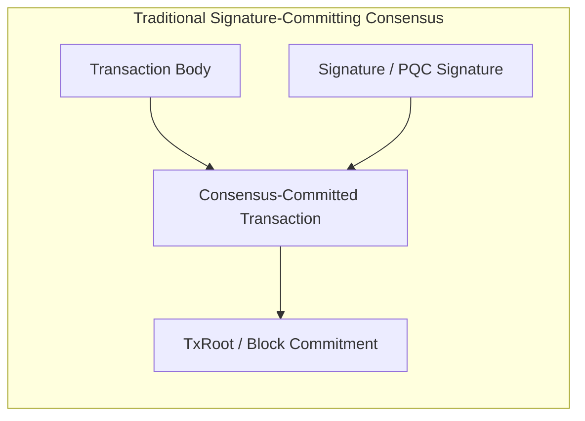
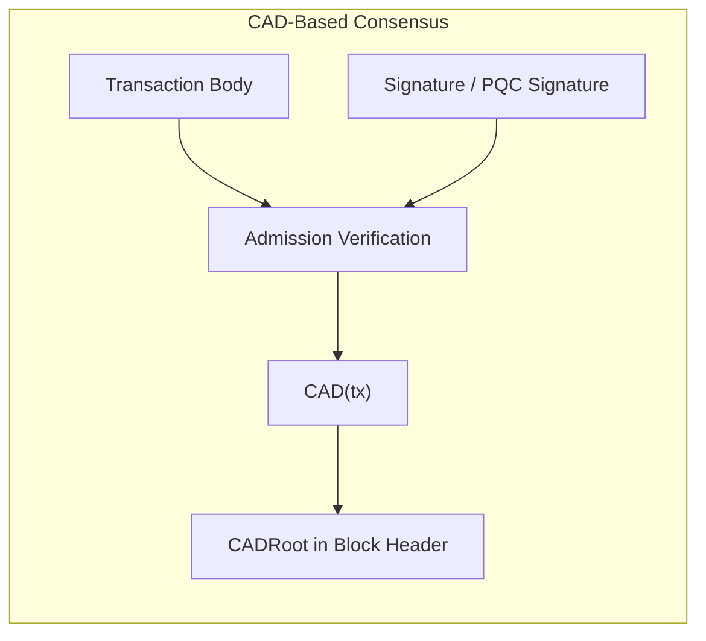
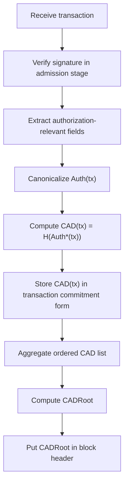
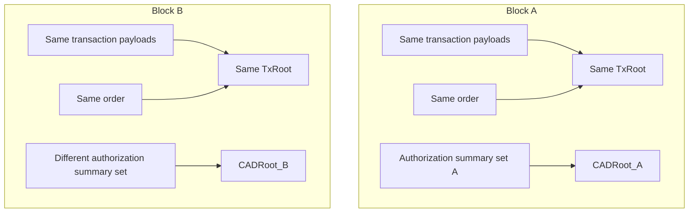
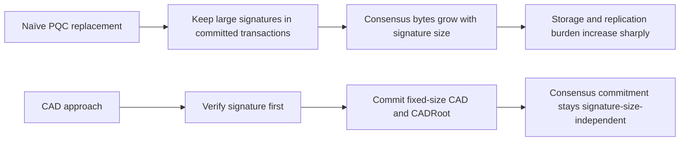
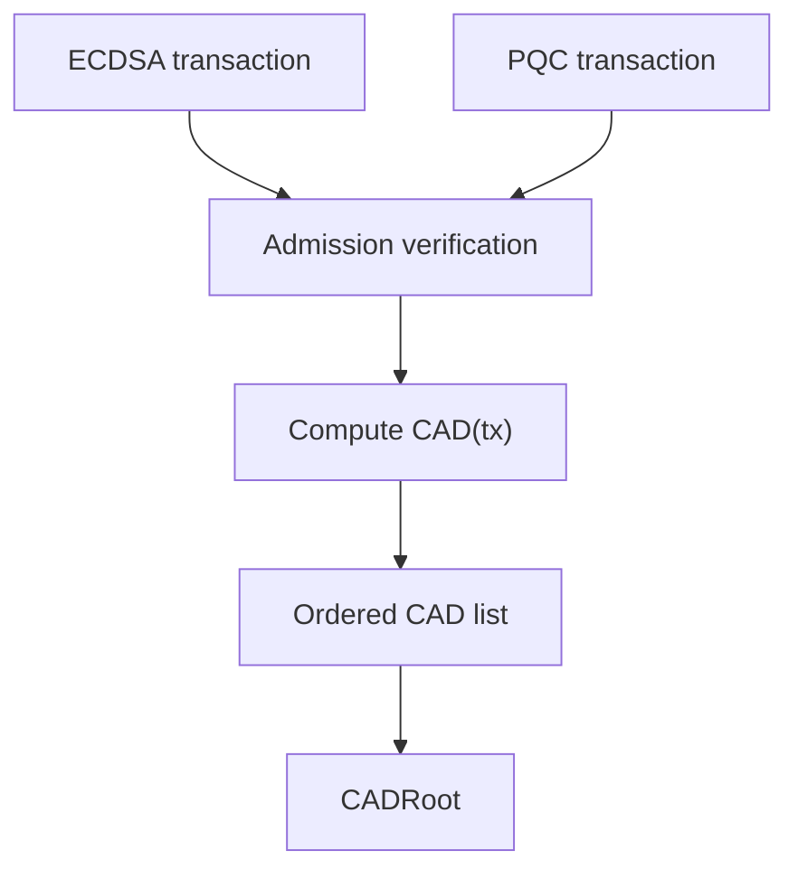

# Consensus Authorization Digest (CAD) Overview

> **Status:** Draft v0.1  
> **Date:** 2026-05-15  
> **Primary Reference:** *Consensus Authorization Digest (CAD) Enables Quantum-Resistant Blockchains for Any PQC Signature*  
> **Role:** Visual and reader-friendly overview of the CAD architecture for SymVerse V3

---

# 1. Why This Overview Exists

The CAD paper makes a simple but important point:

> Post-quantum migration is not only about changing the signature algorithm.  
> It is also about changing **what the blockchain consensus permanently commits**.

If a blockchain keeps large post-quantum signatures inside the consensus-committed transaction object, then:

- block data becomes larger,
- storage grows faster,
- network replication becomes heavier,
- decentralization becomes harder to preserve.

CAD solves this by changing the commitment model:

- signatures are verified during **admission**,
- the consensus layer commits only a **fixed-size authorization digest**,
- the block header carries only a **fixed-size CADRoot**.

This document explains that idea with **figures and tables first**, and leaves the formal rules to [`cad-spec.md`](./cad-spec.md).

---

# 2. One-Page Summary

## The core message

- **Old model:** consensus commits raw signatures
- **Problem:** PQC signatures are much larger than legacy signatures
- **Result:** commitment, storage, and replication cost rise sharply
- **CAD model:** verify signatures first, then commit only fixed-size digests
- **Result:** consensus commitment becomes independent of signature byte size

---

# 3. Figure 1 — Existing Model vs CAD Model



In the traditional model, the signature remains inside the transaction object that consensus commits.

When the signature gets larger, the committed object also gets larger.



In the CAD model, the signature is still verified, but the consensus layer keeps only a fixed-size digest.

---

# 4. Table 1 — Traditional Consensus vs CAD

| Dimension | Traditional Signature-Committing Model | CAD Model |
|---|---|---|
| What consensus commits | Transaction object including signature evidence | Fixed-size authorization digest |
| Signature bytes in commitment path | Yes | No |
| Per-transaction commitment growth | Grows with signature size | Fixed-size |
| Block-header commitment | TxRoot only | TxRoot + CADRoot (fixed-size) |
| PQC migration effect | Large signatures inflate committed data | Signature size does not inflate CAD commitment |
| Consensus coupling | Strongly tied to signature representation | Decoupled from raw signature bytes |

---

# 5. Figure 2 — CAD Processing Flow



This is the central logic of CAD:

1. verify first,  
2. summarize second,  
3. commit the summary, not the raw signature.

---

# 6. Why TxRoot Alone Is Not Enough

A natural question is:

> “If we already have `TxRoot`, why do we need `CADRoot`?”

The CAD paper says the answer is **because `TxRoot` does not capture the authorization-summary role that CAD captures**.

Two bad options exist:

## Option A — TxRoot includes signatures

Then PQC signatures remain part of the consensus commitment.  
The scaling problem remains unsolved.

## Option B — TxRoot excludes signatures

Then `TxRoot` no longer fully captures the authorization-outcome summary needed by the CAD model.

So CAD introduces a separate commitment:

- `CAD(tx)` per transaction
- `CADRoot` per block

---

# 7. Figure 3 — Same TxRoot, Different CADRoot



This figure illustrates the paper’s core claim:

```text
Same TxRoot does not imply same CADRoot
```

So `CADRoot` is not redundant.

---

# 8. Table 2 — Annual Commitment Impact

The paper uses a 2025 Ethereum L1 workload snapshot and compares the **annual consensus commitment burden**.

## Assumptions

- Transactions/year = `580,264,117`
- Blocks/year = `2,628,000`

## Result Summary

| Design / Scheme | AnnualCommit (GiB/year) | × Legacy |
|---|---:|---:|
| Legacy ECDSA + PoS BLS | 35.38 | 1.00× |
| Naïve ML-DSA-44 | 1308.26 | 36.99× |
| Naïve ML-DSA-65 | 1788.69 | 50.55× |
| Naïve ML-DSA-87 | 2500.96 | 70.68× |
| Naïve SL-DSA-512 | 360.38 | 10.18× |
| Naïve SL-DSA-1024 | 692.19 | 19.57× |
| Naïve SLH-DSA-128s | 4245.95 | 120.02× |
| Naïve SLH-DSA-192s | 8768.13 | 247.79× |
| CAD (any supported signature scheme) | 17.60 | 0.50× |

---

# 9. Figure 4 — Interpreting the Cost Result



The point is not that every blockchain will have exactly the same annual numbers.  
The point is that the **direction of growth is structural**:

- naïve replacement remains signature-size-dependent,
- CAD is not.

---

# 10. Table 3 — What CAD Changes and What It Does Not

| CAD Changes | CAD Does Not Automatically Solve |
|---|---|
| What consensus commits | Wallet migration |
| How authorization outcomes are summarized | Key rotation policy |
| How block headers bind authorization summaries | Governance / upgrade policy |
| Dependence of commitment size on signature size | Choice of the “best” PQC algorithm |
| Support for mixed signature families at commitment level | General key management UX |

---

# 11. Figure 5 — Dual-Acceptance Model



This is another major advantage of CAD:

- ECDSA and PQC transactions can coexist during migration
- the execution layer handles scheme-specific verification
- the consensus layer still commits the same kind of object

---

# 12. Key Takeaways

## 12.1 Technical takeaway

CAD changes the consensus commitment object from:

```text
raw signature-bearing transaction commitment
```

to:

```text
fixed-size authorization-outcome commitment
```

## 12.2 Protocol takeaway

CAD allows a blockchain to support different signature schemes without forcing the consensus layer to scale with the size of those signatures.

## 12.3 V3 takeaway

For SymVerse V3, CAD suggests that the protocol should define:

- `Auth(tx)`
- `CAD(tx)`
- `CADRoot`
- block-validation equality rules
- signature handling policy after admission

These formal details are specified in:

- [`cad-spec.md`](./cad-spec.md)

---

# 13. Recommended Reading After This Document

1. [`cad-spec.md`](./cad-spec.md)
2. [`transaction-spec.md`](./transaction-spec.md)
3. [`pqc-account-spec.md`](./pqc-account-spec.md)
4. [`testing-guide.md`](./testing-guide.md)

---

# 14. Revision History

| Version | Date | Notes |
|---|---|---|
| v0.1 | 2026-05-15 | Initial visual overview with figure-first explanation and key results tables |
