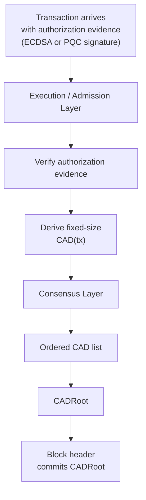
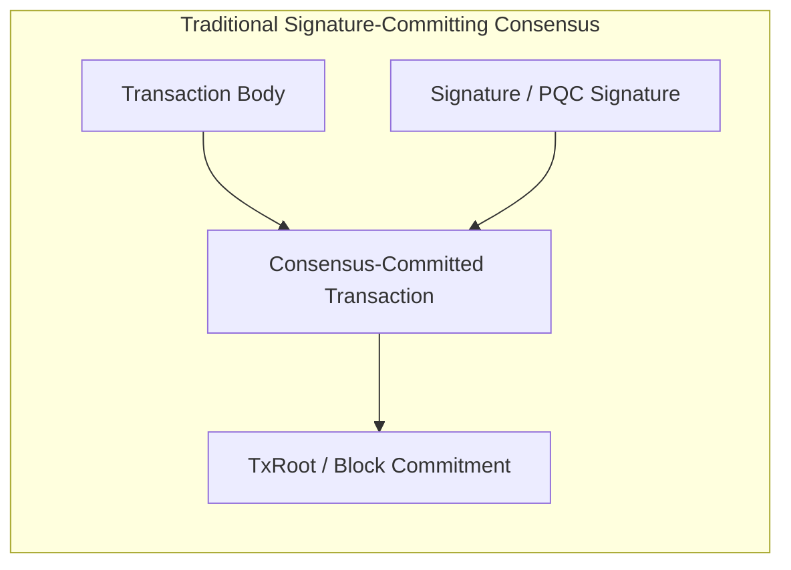
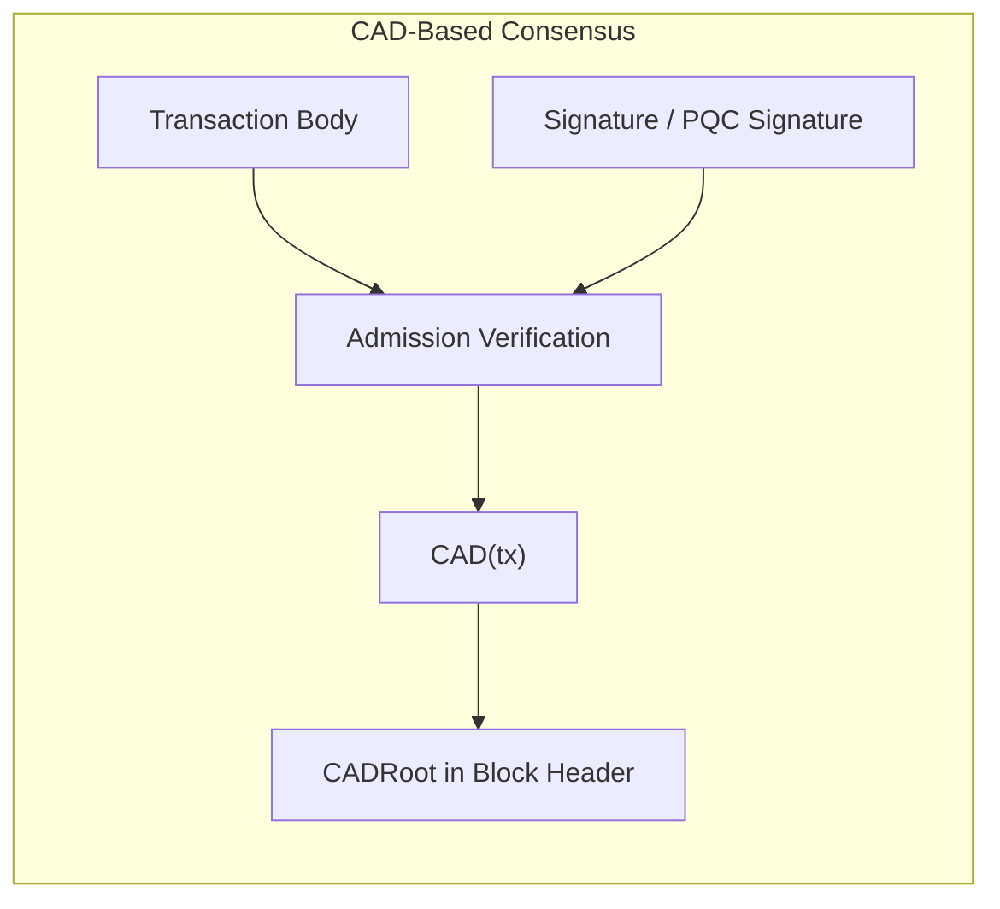
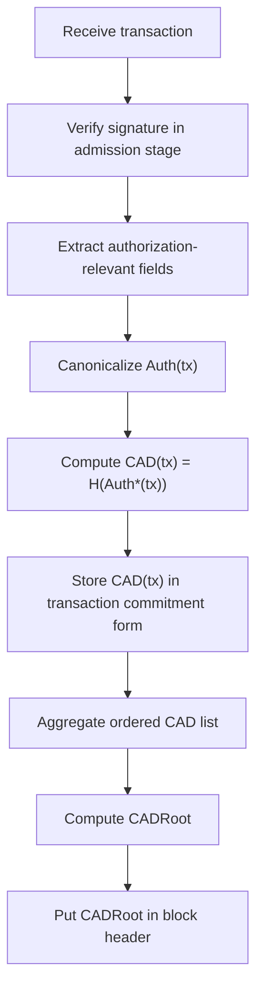
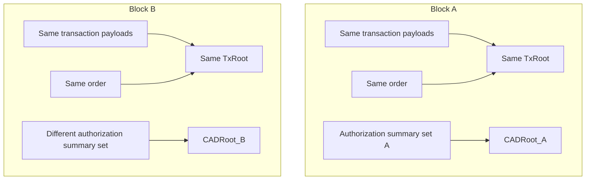
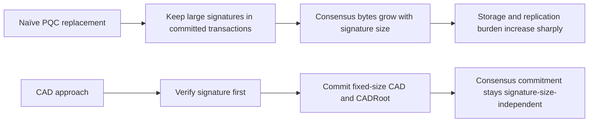
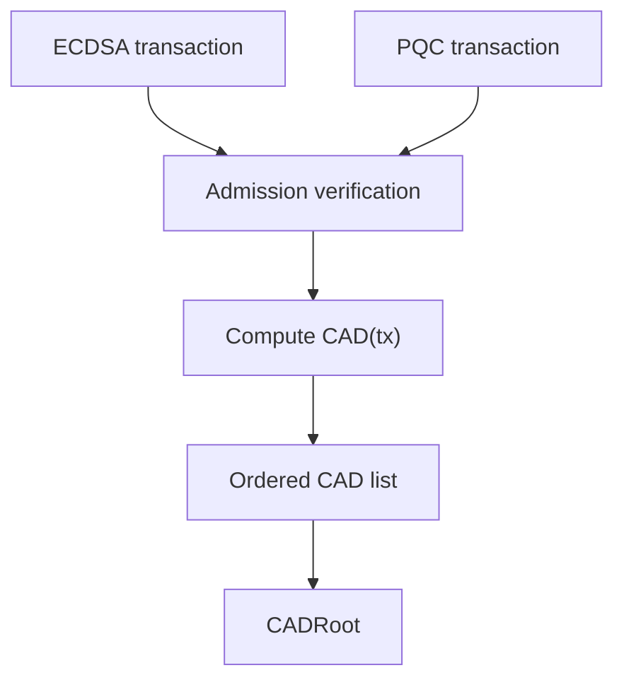

# Consensus Authorization Digest (CAD) Overview

> **Status:** Draft v0.5  
> **Date:** 2026-05-15  
> **Reference Paper:** [Consensus Authorization Digest (CAD) Enables Quantum-Resistant Blockchains for Any PQC Signature](https://www.researchsquare.com/article/rs-8890873/v1)  
> **Publication Status:** Research Square preprint, currently **under review at Nature Communications** through the **In Review** workflow.  
> **Primary Reference:** *Consensus Authorization Digest (CAD) Enables Quantum-Resistant Blockchains for Any PQC Signature*  
> **Role:** Visual and reader-friendly overview of the CAD architecture for SymVerse V3

---

# 1. Why This Overview Exists

Post-quantum blockchain migration is not only a matter of replacing ECDSA with a larger quantum-resistant signature.

A direct replacement approach creates a structural problem:

- PQC signatures are much larger than legacy signatures,
- every transaction becomes heavier,
- block propagation becomes more expensive,
- long-term storage burden grows sharply,
- and the cost of operating fully validating nodes increases.

**Consensus Authorization Digest (CAD)** addresses this problem by separating:

```text
signature verification
```

from:

```text
consensus commitment
```

The core design principle is:

> The execution path verifies the required signature evidence,  
> while the consensus path permanently commits a fixed-size authorization digest.

In other words:

- the transaction may arrive with a large PQC signature,
- validators verify that authorization during admission and block validation,
- the blockchain commitment layer binds the accepted authorization outcome through `CAD(tx)` and `CADRoot`,
- the raw signature representation does not define the size of the consensus authorization commitment.

This is the architectural reason CAD matters for PQC blockchains.

The formal rules are specified in [`cad-spec.md`](./cad-spec.md).  
This document explains the same idea visually and intuitively.

---

# 1.1 CAD Architecture in One Diagram



The important separation is:

| Layer | Role |
|---|---|
| Execution / Admission | Verify the transaction’s authorization evidence |
| CAD | Convert the accepted authorization outcome into a fixed-size digest |
| Consensus | Commit the ordered CAD set through `CADRoot` |
| Block Header | Permanently bind the authorization summary at block level |

---

# 2. One-Page Summary

## 2.1 The capacity problem in PQC blockchains

A naïve PQC migration keeps the existing transaction commitment model and simply replaces the old signature with a much larger post-quantum signature.

That creates a direct size dependency:

```text
larger signature
  → larger transaction bytes
  → larger replicated block data
  → larger storage and bandwidth burden
```

## 2.2 The CAD response

CAD changes the question from:

```text
How do we store very large PQC signatures in the ledger?
```

to:

```text
How do we commit the validated authorization outcome
without making consensus commitment size depend on raw signature size?
```

## 2.3 The core message

- **Traditional model:** consensus commitment remains tied to raw signature-bearing transaction data
- **Problem:** PQC signatures are much larger than legacy signatures
- **Result:** committed bytes, storage pressure, and replication costs increase
- **CAD model:** verify authorization first, then commit a fixed-size authorization digest
- **Result:** the consensus authorization commitment becomes independent of raw signature byte size

---

# 3. Figure 1 — Existing Model vs CAD Model



In the traditional model, the signature remains inside the transaction object that consensus commits.

When the signature gets larger, the committed object also gets larger.



In the CAD model, the signature is still verified, but the consensus layer keeps only a fixed-size digest.

---

# 4. Table 1 — Traditional PQC Replacement vs CAD

| Dimension | Naïve PQC Replacement | CAD Model |
|---|---|---|
| Signature handling | Large PQC signature bytes remain coupled to committed transaction representation | Authorization evidence is verified, while consensus authorization commitment uses fixed-size CAD |
| Authorization commitment | Signature-size-dependent | Fixed-size digest per accepted transaction |
| Block-level authorization binding | Implicitly tied to signature-bearing transaction commitment | Explicit `CADRoot` in block header |
| Storage pressure | Grows sharply as signature schemes become larger | Authorization commitment size remains signature-size-independent |
| Network replication pressure | Increases with raw signature payload | CAD commitment path remains compact |
| Cryptographic agility | Commitment design remains affected by signature representation size | Consensus commitment remains stable across supported signature families |

---

# 4.1 What CAD Does — and What It Does Not Mean

CAD does **not** mean that signatures are ignored.

It means:

1. authorization evidence is still verified,
2. invalid signatures are still rejected,
3. consensus commits the resulting authorization outcome through fixed-size digest material.

CAD also does not by itself prescribe every retention or data-availability policy for raw signature evidence.  
Those are protocol-policy questions around transaction propagation, validation, auditability, and pruning.

The CAD claim is more precise:

```text
consensus authorization commitment
does not have to grow
with raw PQC signature size
```

---

# 5. Figure 2 — CAD Processing Flow



This is the central logic of CAD:

1. verify authorization evidence,  
2. derive the authorization outcome digest,  
3. commit the digest set through `CADRoot`,  
4. keep consensus authorization commitment independent of raw signature byte size.

---

# 6. Why TxRoot Alone Is Not Enough

A natural question is:

> “If we already have `TxRoot`, why do we need `CADRoot`?”

The CAD paper says the answer is **because `TxRoot` does not capture the authorization-summary role that CAD captures**.

Two bad options exist:

## Option A — TxRoot includes signatures

Then PQC signatures remain part of the consensus commitment.  
The scaling problem remains unsolved.

## Option B — TxRoot excludes signatures

Then `TxRoot` no longer fully captures the authorization-outcome summary needed by the CAD model.

So CAD introduces a separate commitment:

- `CAD(tx)` per transaction
- `CADRoot` per block

---

# 7. Figure 3 — Same TxRoot, Different CADRoot



This figure illustrates the paper’s core claim:

```text
Same TxRoot does not imply same CADRoot
```

So `CADRoot` is not redundant.

---

# 8. Table 2 — Annual Commitment Impact

The paper uses a 2025 Ethereum L1 workload snapshot and compares the **annual consensus commitment burden**.

## Assumptions

- Transactions/year = `580,264,117`
- Blocks/year = `2,628,000`

## Result Summary

| Design / Scheme | AnnualCommit (GiB/year) | × Legacy |
|---|---:|---:|
| Legacy ECDSA + PoS BLS | 35.38 | 1.00× |
| Naïve ML-DSA-44 | 1308.26 | 36.99× |
| Naïve ML-DSA-65 | 1788.69 | 50.55× |
| Naïve ML-DSA-87 | 2500.96 | 70.68× |
| Naïve SL-DSA-512 | 360.38 | 10.18× |
| Naïve SL-DSA-1024 | 692.19 | 19.57× |
| Naïve SLH-DSA-128s | 4245.95 | 120.02× |
| Naïve SLH-DSA-192s | 8768.13 | 247.79× |
| CAD (any supported signature scheme) | 17.60 | 0.50× |

---

# 9. Figure 4 — Interpreting the Cost Result



The point is not that every blockchain will have exactly the same annual numbers.  
The point is that the **direction of growth is structural**:

- naïve replacement remains signature-size-dependent,
- CAD is not.

---

# 10. Table 3 — What CAD Changes and What It Does Not

| CAD Changes | CAD Does Not Automatically Solve |
|---|---|
| What consensus commits | Wallet migration |
| How authorization outcomes are summarized | Key rotation policy |
| How block headers bind authorization summaries | Governance / upgrade policy |
| Dependence of commitment size on signature size | Choice of the “best” PQC algorithm |
| Support for mixed signature families at commitment level | General key management UX |

---

# 11. Figure 5 — Dual-Acceptance Model



This is another major advantage of CAD:

- ECDSA and PQC transactions can coexist during migration
- the execution layer handles scheme-specific verification
- the consensus layer still commits the same kind of object

---

# 12. Security Meaning at a Glance

CAD changes the commitment structure, but it does **not** relax transaction validity.

| Security Concern | CAD Interpretation |
|---|---|
| Invalid signature | Rejected during authorization verification |
| Forged authorization | Does not produce a valid accepted CAD outcome |
| Block mutation | Changes in ordered CAD outcomes change `CADRoot` |
| Authorization-summary mismatch | Detected through CAD/CADRoot validation rules |
| Replay or state-rule violations | Still governed by the underlying transaction and state-transition rules |

The key point is:

```text
CAD separates raw signature bytes from consensus commitment,
not authorization security from transaction validation.
```

A transaction becomes consensus-relevant only after its authorization outcome is validated under the protocol rules defined in the formal CAD specification.

---

# 13. Key Takeaways

## 13.1 Technical takeaway

CAD changes the consensus commitment object from:

```text
raw signature-bearing transaction commitment
```

to:

```text
fixed-size authorization-outcome commitment
```

## 13.2 Protocol takeaway

CAD allows a blockchain to support different signature schemes without forcing the consensus layer to scale with the size of those signatures.

## 13.3 V3 takeaway

For SymVerse V3, CAD suggests that the protocol should define:

- `Auth(tx)`
- `CAD(tx)`
- `CADRoot`
- block-validation equality rules
- signature handling policy after admission

These formal details are specified in:

- [`cad-spec.md`](./cad-spec.md)

---

# 14. Recommended Reading After This Document

1. [`cad-spec.md`](./cad-spec.md)
2. [`transaction-spec.md`](./transaction-spec.md)
3. [`pqc-account-spec.md`](./pqc-account-spec.md)
4. [`testing-guide.md`](./testing-guide.md)

---

# 15. Revision History

| Version | Date | Notes |
|---|---|---|
| v0.1 | 2026-05-15 | Initial visual overview with figure-first explanation and key results tables |
| v0.2 | 2026-05-16 | Strengthened the overview around the PQC capacity problem, added a concise CAD architecture diagram, expanded the traditional-vs-CAD comparison, clarified what CAD does and does not claim, and added a security-meaning summary section |
| v0.3 | 2026-05-16 | Added a direct reference link to the Research Square CAD preprint that underpins this overview |
| v0.4 | 2026-05-16 | Clarified that the linked Research Square CAD manuscript is a preprint currently marked Under Review and presented through the In Review workflow associated with Nature Portfolio review |
| v0.5 | 2026-05-16 | Refined the publication-status note to state that the CAD preprint is currently under review at Nature Communications through the In Review workflow |
