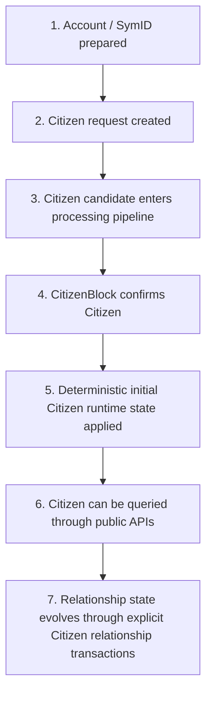

# SymVerse V3 Citizen Protocol Specification

> **Status:** Draft v0.1  
> **Date:** 2026-05-15  
> **Document Role:** Protocol-level specification for Citizen identity, CitizenBlock confirmation, initial citizen runtime state, and citizen relationship operations in SymVerse V3

---

# 1. Purpose

This document defines the **SymVerse V3 Citizen Protocol**.

The Citizen Protocol defines how a SymVerse identity is:

1. created,
2. confirmed through CitizenBlock processing,
3. initialized with deterministic citizen-owned state,
4. extended through explicit citizen relationship transactions,
5. queried through public Citizen APIs,
6. reconstructed consistently during restart and sync.

The Citizen Protocol is therefore the correct specification boundary for SymVerse V3.

---

# 2. Design Position

## 2.1 Citizen Is a Protocol Object

In SymVerse V3, a **Citizen** is not merely an application profile or membership record.

A Citizen is a protocol-level identity object that connects:

- account authorization data,
- SymID identity,
- CitizenBlock confirmation,
- deterministic citizen-owned metadata,
- optional PQC capability information,
- public query behavior,
- and transaction-governed relationship state.

---

---

# 3. Scope

This specification covers:

1. Citizen terminology and protocol object boundaries
2. Citizen creation lifecycle
3. CitizenBlock confirmation semantics
4. Citizen-owned deterministic bootstrap state
5. Nickname registration policy
6. Deterministic RefCode generation
7. Referrer policy
8. Link / LinkedBy relationship semantics
9. PQC-aware Citizen metadata
10. Public Citizen API expectations
11. Determinism, restart persistence, and sync consistency
12. Validation and test requirements

This document does **not** finalize:

- exact JSON-RPC response schemas,
- exact RLP or storage encoding,
- final transaction payload byte layouts,
- wallet UX,
- UI nickname-display rules,
- future governance rules for citizen-policy upgrades.

Those topics should be maintained in their own implementation or API documents.

---

# 4. Terminology

| Term | Meaning |
|---|---|
| **Citizen** | Protocol-level SymVerse identity object |
| **SymID** | SymVerse identity/address associated with a Citizen |
| **CitizenBlock** | Block structure that confirms new Citizen records |
| **Citizen payload** | Input data used to create a Citizen candidate |
| **Citizen runtime state** | Deterministic or transaction-driven state associated with a Citizen |
| **Nickname** | Citizen-owned public identifier |
| **RefCode** | Deterministic Citizen owner code derived from CitizenBlock placement |
| **InputRefCode** | Optional referral code supplied during citizen-request flow; baseline V3 does not auto-create Referrer during Citizen creation |
| **Referrer** | Explicit relationship state registered through Citizen relationship operations |
| **Link** | Forward directional relation from Citizen A to Citizen B |
| **LinkedBy** | Reverse-query view showing who linked the current Citizen |
| **PQC metadata** | Citizen/account authorization metadata such as `QAlgo` and `QKeyPub` |
| **CADFork** | Protocol activation boundary for CAD-enabled post-quantum architecture |

---

# 5. Citizen Protocol Object Model

## 5.1 Citizen, Account, and SymID

The protocol SHOULD distinguish related but different concepts:

| Concept | Role |
|---|---|
| **Account** | Authorization object controlled by cryptographic keys |
| **SymID** | SymVerse identity/address value |
| **Citizen** | Protocol-confirmed identity record associated with a SymID |

A Citizen may expose account-related authorization metadata, but the Citizen Protocol remains concerned with **identity confirmation and citizen-state behavior**, not only private-key ownership.

---

## 5.2 Citizen Metadata Categories

A Citizen record may involve the following categories:

| Category | Examples |
|---|---|
| Identity | SymID, Citizen existence, CitizenBlock context |
| Authorization | `AKeyPubH`, legacy/PQC authorization indicators |
| PQC metadata | `QAlgo`, `QKeyPub` |
| Citizen public identity | Nickname |
| Deterministic citizen owner code | RefCode |
| Relationship state | Referrer, Link, LinkedBy |
| Query/runtime presentation | display-ready citizen view through public APIs |

---

## 5.3 PQC-Aware Citizen Metadata

SymVerse V3 Citizens may carry PQC-related authorization information.

A representative implementation concept is:

```go
type QuantumInfo struct {
    QAlgo   *uint16
    QKeyPub []byte
}
```

Within the Citizen Protocol, PQC metadata matters because:

1. Citizen creation may establish a PQC-capable identity,
2. public Citizen queries should expose authorization-relevant metadata where specified,
3. CADFork-era transaction validation may rely on the account/Citizen authorization model,
4. the protocol should remain compatible with multiple PQC signature schemes.

Detailed algorithm policy is handled in:

- `pqc-account-spec.md`
- `transaction-spec.md`
- `cad-spec.md`

---

# 6. Citizen Lifecycle

## 6.1 High-Level Lifecycle

The Citizen Protocol follows this conceptual lifecycle:



---

## 6.2 Lifecycle Stages

| Stage | Description |
|---|---|
| Prepare account | ECDSA or PQC-capable account material exists |
| Submit Citizen request | Citizen creation data is submitted |
| Candidate processing | Node pipeline validates and pools the candidate |
| CitizenBlock confirmation | Citizen becomes protocol-confirmed |
| Initial runtime application | Deterministic initial Nickname/RefCode policy is applied |
| Public visibility | Citizen can be resolved by SymID, Nickname, and citizen query APIs |
| Relationship evolution | Referrer and Link graph state change only through explicit operations |

---

# 7. Citizen Creation and CitizenBlock Confirmation

## 7.1 Citizen Creation Principle

Citizen creation SHOULD be treated as a protocol-controlled process, not as a mere local account-generation helper.

A newly generated account is not equivalent to a protocol-confirmed Citizen until its Citizen record is confirmed through the CitizenBlock flow.

---

## 7.2 CitizenBlock Confirmation Boundary

The CitizenBlock confirmation boundary is important because certain Citizen runtime state must be applied only after the Citizen is canonically confirmed.

Examples include:

- initial Nickname ownership registration, when a Nickname is provided,
- deterministic RefCode generation,
- citizen-facing lookup consistency.

The conceptual rule is:

```text
Citizen creation request
        ≠
confirmed Citizen state

confirmed Citizen state
        =
CitizenBlock-confirmed identity + deterministic initial Citizen runtime application
```

---

## 7.3 Deterministic Initial Runtime Application

The implementation may expose this conceptually as:

```text
ApplyInitialMembershipRuntimeFromCitizenBlock()
```

or an equivalent Citizen protocol initialization path.

The purpose is to guarantee that:

1. all nodes derive the same initial citizen-owned runtime state,
2. the initialization is based on canonical CitizenBlock context,
3. restart and sync rebuild the same results.

---

# 8. Initial Citizen Runtime Policy

## 8.1 What May Be Initialized Automatically

At CitizenBlock confirmation, the protocol MAY initialize only deterministic citizen-owned state.

| State | Auto-initialized at Citizen confirmation? | Rationale |
|---|---:|---|
| Citizen existence | Yes | CitizenBlock confirms it |
| Nickname owner mapping | Yes, when Nickname is present | Self-owned public identifier |
| RefCode | Yes | Deterministic Citizen owner code |
| Referrer | No | Relationship state must be explicit |
| Link | No | Relationship state must be explicit |
| LinkedBy | No | Reverse relationship view derives from explicit links |

---

## 8.2 Final V3 Baseline Policy

The V3 baseline policy is:

```text
Citizen creation may initialize:
- Nickname ownership
- RefCode

Citizen creation must not automatically initialize:
- Referrer
- Link
- LinkedBy
```

Referrer and Link state are handled by explicit Citizen relationship transaction operations.

---

# 9. Nickname Protocol

## 9.1 Purpose

A **Nickname** is a public Citizen identifier.

It provides:

- human-readable citizen lookup,
- nickname-to-owner resolution,
- clearer public identity presentation.

---

## 9.2 Optionality

Nickname is optional during Citizen creation.

The protocol SHOULD accept:

```text
nickname == ""
```

without treating it as an error.

---

## 9.3 Ownership Rule

A Nickname MUST resolve to at most one current Citizen owner at a given state height.

If a requested Nickname is already owned according to protocol rules, the registration SHOULD be rejected.

---

## 9.4 Registration Timing

When a Citizen creation request includes a Nickname, the Nickname ownership mapping SHOULD be registered only after CitizenBlock confirmation.

This avoids:

- unconfirmed nickname reservation,
- non-canonical pre-confirmation state,
- sync inconsistency.

---

## 9.5 Replacement / Deletion Policy

A final policy for nickname replacement, deletion, or reassignment MUST be specified separately if the feature is adopted.

This specification only defines:

- optional initial registration,
- unique ownership,
- post-confirmation deterministic application.

---

# 10. RefCode Protocol

## 10.1 Definition

A **RefCode** is a deterministic Citizen owner code.

It is not a user-chosen display string and not a mutable campaign identifier.  
It is a protocol-derived value linked to CitizenBlock confirmation context.

---

## 10.2 Generation Rule

The V3 baseline rule is:

```text
refCode = (citizenBlockNumber << 12) | citizenIndex
```

---

## 10.3 Capacity

Because 12 bits are reserved for `citizenIndex`, the structure supports:

```text
4096 citizens per CitizenBlock
```

---

## 10.4 Determinism

For the same:

- `citizenBlockNumber`,
- `citizenIndex`,

all honest nodes MUST derive the same `RefCode`.

---

## 10.5 Generation Timing

RefCode MUST be generated only after the Citizen’s position in the CitizenBlock is known.

Therefore:

```text
RefCode generation belongs to CitizenBlock-confirmed initialization,
not to pre-confirmation account creation.
```

---

## 10.6 Public Presentation

The protocol may expose:

- raw numeric RefCode,
- formatted human-readable RefCode,
- or both.

The formatting function MUST NOT alter the underlying deterministic ownership value.

---

# 11. InputRefCode and Referrer Policy

## 11.1 InputRefCode

`InputRefCode` may appear in the broader citizen-request or API workflow as an optional input.

The Citizen Protocol MUST accept:

```text
InputRefCode == 0
```

or an absent input as:

```text
no referral input supplied
```

---

## 11.2 No Automatic Referrer Creation During Citizen Creation

The finalized V3 baseline is:

```text
Citizen creation does not automatically initialize Referrer.
```

Even if an `InputRefCode` exists in a request flow or is resolved by surrounding application/API logic, the Citizen Protocol MUST NOT treat Citizen creation itself as an automatic persistent Referrer mutation.

---

## 11.3 Referrer as Explicit Relationship State

A **Referrer** relationship belongs to explicit Citizen relationship operations.

This separation is important because Referrer is:

- relational,
- mutable or policy-governed,
- not a deterministic property of CitizenBlock position.

---

## 11.4 Validation Expectations

A Referrer registration operation SHOULD validate:

- target Citizen existence,
- RefCode or referenced owner existence, if used,
- self-reference restrictions, if adopted,
- duplicate or update policy,
- authorization of the caller.

Exact payload format belongs in the transaction/API specification.

---

# 12. Link and LinkedBy Protocol

## 12.1 Link Definition

A **Link** is a directional relation from one Citizen to another.

If Citizen `A` links Citizen `B`:

```text
A → B
```

then:

- `A` has `B` in its forward Link set,
- `B` exposes `A` through its reverse LinkedBy view.

---

## 12.2 Link Initialization Rule

Citizen creation MUST NOT auto-initialize Link state.

Link state exists only after explicit Citizen relationship transaction processing.

---

## 12.3 LinkedBy Reverse View

The reverse view is a required public protocol behavior:

```text
A links B
```

MUST be observable as:

```text
Query A → Link includes B
Query B → LinkedBy includes A
```

---

## 12.4 Storage Strategy Is Not Prescribed

Implementations may realize `LinkedBy` as:

- reverse index state,
- mirrored state update,
- another deterministic query structure.

The externally visible result MUST remain consistent.

---

## 12.5 Multi-Link Test Expectation

The V3 test baseline SHOULD include:

```text
at least 10 sequential Link registrations
```

and verify:

- forward query consistency,
- reverse LinkedBy consistency,
- restart persistence,
- sync consistency.

---

# 13. Citizen Public API Expectations

## 13.1 Citizen by SymID

A public Citizen API SHOULD support querying a Citizen by SymID.

Representative method:

```text
citizen_getCitizenBySymID
```

The response should be able to present an integrated Citizen view, including where applicable:

- SymID,
- Citizen existence,
- Citizen metadata,
- PQC fields such as `QAlgo`, `QAlgoName`, `QKeyPub`,
- Nickname,
- RefCode or display-ready owner code,
- Referrer,
- Link count / Links,
- LinkedBy count / LinkedBy,
- domain or protocol context fields where defined.

---

## 13.2 Citizen by Nickname

A public API SHOULD support Citizen lookup by Nickname.

Representative method:

```text
citizen_getCitizenByNick
```

The query should resolve:

```text
Nickname → Citizen owner / Citizen view
```

---

## 13.3 Citizen Protocol vs Membership API Surface

Citizen-related query methods SHOULD be presented as part of the **Citizen Protocol API surface**.

This is because:

- Nickname belongs to Citizen identity,
- RefCode belongs to Citizen owner-code semantics,
- Referrer and Link belong to Citizen relationship state.

---

# 14. State Placement and Runtime Interpretation

## 14.1 Citizen Runtime State

The Citizen Protocol distinguishes:

1. protocol-confirmed Citizen data,
2. runtime registry/index data used for Citizen lookup and relationships.

The current V3 implementation direction stores citizen relationship/runtime registry state in reserved main-state storage rather than treating every relationship update as a new CitizenBlock object.

---

## 14.2 Why Relationship Updates Are Transactions

Nickname/Referrer/Link changes SHOULD NOT require re-creating a new CitizenBlock entry for the same address.

Instead:

- CitizenBlock confirms Citizen creation,
- later citizen relationship changes are ordinary explicit protocol transactions.

This avoids unnecessary CitizenBlock growth for mutable citizen-state evolution.

---

# 15. Determinism, Restart, and Sync

## 15.1 Deterministic Processing

All protocol-visible Citizen state transitions MUST be deterministic.

This includes:

- CitizenBlock-confirmed Nickname ownership application,
- RefCode derivation,
- explicit Referrer updates,
- explicit Link/LinkedBy state updates.

---

## 15.2 Restart Persistence

After node restart, the following MUST remain queryable and consistent:

- Citizen existence,
- Nickname ownership,
- RefCode,
- Referrer,
- Link,
- LinkedBy.

---

## 15.3 Sync Consistency

A syncing node MUST reconstruct Citizen Protocol state consistently with a node that observed the original execution path.

After synchronization, the following query results MUST match canonical state:

- Citizen by SymID,
- Citizen by Nickname,
- RefCode,
- Referrer,
- Link list,
- LinkedBy list.

---

## 15.4 CitizenBlock Import and Rebuild Consistency

The block-creator path and block-import/sync path MUST produce the same Citizen-related state roots and runtime views.

Any Citizen initialization routine must therefore be:

- consensus-deterministic,
- called consistently across production and import paths,
- free of non-canonical local dependence.

---

# 16. Citizen Protocol Validation Requirements

The protocol implementation SHOULD reject or prevent:

1. duplicate Nickname ownership conflicts,
2. invalid RefCode derivation caused by out-of-range Citizen index,
3. automatic Referrer/Link side effects during Citizen creation,
4. Link operations against non-existent citizens, if required by final policy,
5. inconsistent LinkedBy reverse state,
6. sync/import divergence in Citizen runtime application.

---

# 17. Minimum Test Matrix

| Test Area | Required Check |
|---|---|
| Citizen creation | Citizen becomes queryable only after confirmation |
| CitizenBlock application | Initial runtime state applies deterministically |
| Nickname | Optional empty nickname passes; valid nickname resolves |
| Nickname conflict | Duplicate ownership rejected |
| RefCode | Formula and display code remain stable |
| Referrer | Not auto-created during Citizen creation |
| Link | Explicit forward link registration succeeds |
| LinkedBy | Reverse query reflects the Link source |
| Restart | Citizen protocol state survives node restart |
| Sync | Synced node reconstructs same Citizen view |
| PQC Citizen | `QAlgo` / `QKeyPub`-aware Citizen query remains stable |

---

# 18. Relationship to Other V3 Documents

| Document | Relationship |
|---|---|
| `v3-basic-spec.md` | Overall V3 architecture and terminology |
| `pqc-account-spec.md` | PQC authorization metadata connected to Citizen identity |
| `transaction-spec.md` | Citizen relationship operation payloads and authorization |
| `cad-spec.md` | CAD authorization commitment after CADFork |
| `rpc-api-spec.md` | Public query and submission surfaces |
| `testing-guide.md` | Reproducible Citizen protocol scenarios |

---

# 19. Open Items

The following items remain to be finalized in later revisions:

1. final Citizen payload schema,
2. exact storage schema of citizen runtime registry slots,
3. canonical formatted RefCode display specification,
4. final Nickname replacement/deletion policy,
5. final Referrer update/deletion policy,
6. Link deletion/unlink semantics,
7. historical-state query behavior,
8. exact JSON-RPC response field names and examples,
9. migration behavior for legacy Citizens.

---

# 20. Revision History

| Version | Date | Notes |
|---|---|---|
| v0.1 | 2026-05-15 | Initial Citizen Protocol Specification covering Citizen lifecycle, CitizenBlock confirmation, deterministic initial state, RefCode, Nickname, explicit relationship operations, Citizen APIs, and sync/restart requirements |
